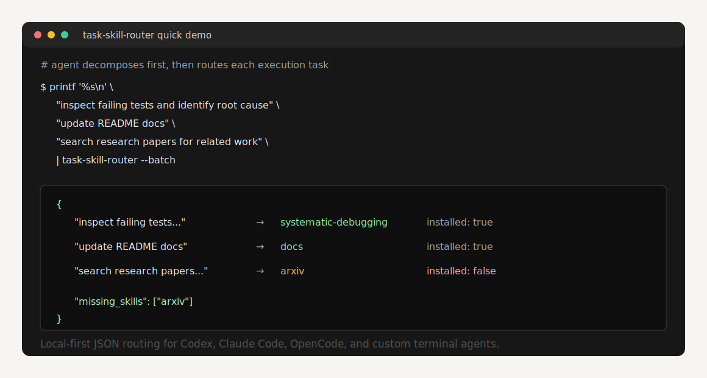

# task-skill-router

[](https://github.com/wcqxgjy6d8-pixel/task-skill-router/actions/workflows/ci.yml)
[](https://github.com/wcqxgjy6d8-pixel/task-skill-router/releases)
[](LICENSE)

Post-decomposition skill routing for terminal coding agents.

task-skill-router scans one or more `SKILL.md` libraries, reads their frontmatter,
enriches them with optional community mappings, and returns ranked JSON
suggestions for decomposed execution tasks.

It is built for Codex, Claude Code, OpenCode, custom terminal agents, and any
workflow where slash commands or skills have become too many to remember.

Local-first by design: no telemetry, no background service, and no maintainer
data collection. See [Privacy](PRIVACY.md).



## Quick Demo

Run this from a local clone. It uses synthetic demo skills in
[`examples/`](examples/), so you do not need real Codex or Claude Code skills
installed first.

```bash
printf '%s\n' \
  "inspect failing tests and identify root cause" \
  "update README docs" \
  "search research papers for related work" \
  | TASK_SKILL_ROUTER_CONFIG=examples/demo-config.yaml python3 task-skill-router.py --batch
```

The output is JSON, so agents and shell scripts can consume it directly:

```json
{
  "batch": true,
  "results": [
    {
      "task": "inspect failing tests and identify root cause",
      "matches": [
        {
          "skill": "systematic-debugging",
          "installed": true,
          "confidence": 0.42,
          "mode": "recommend"
        }
      ]
    }
  ],
  "missing_skills": [
    {
      "skill": "arxiv",
      "install_hint": "Install an arxiv or literature-search skill before research-heavy tasks."
    }
  ]
}
```

## What It Does

The agent should not run the router before understanding the request. The right
flow is:

1. Understand the user's request.
2. Decompose it into concrete execution tasks.
3. Run task-skill-router for each task.
4. Load or recommend the matched skill for execution.
5. Tell the user when a useful skill exists but is not installed.

For one decomposed task:

```bash
task-skill-router "inspect failing auth test and identify root cause"
```

For multiple decomposed tasks:

```bash
printf '%s\n' \
  "inspect failing auth test and identify root cause" \
  "write a regression test for the root cause" \
  "verify the fix before completion" \
  | task-skill-router --batch
```

The router answers:

- which skill probably applies to each execution task
- whether that skill is installed locally
- where the matching `SKILL.md` lives
- whether to auto-load it or only recommend it
- whether the task looks high-risk
- which missing skills would improve execution

This does not require modifying the agent's source code. Hard integration is
best, but soft integration through `AGENTS.md`, `CLAUDE.md`, workspace rules, or
a shell wrapper is enough for many terminal coding tools.

## Why

Large user requests often need different skills for different parts:

- inspect a failing test: `systematic-debugging`
- implement a fix: `test-driven-development`
- update docs: `chinese-documentation` or another docs skill
- verify the final state: `verification-before-completion`

A single router call on the original user request is too coarse. task-skill-router is
the layer between planning and execution: decompose first, route each unit,
execute with the right skill, verify at the end.

It is a lightweight heuristic, not an autopilot. Scores are TF-IDF cosine
similarities, not calibrated probabilities.

## How It Works

```text
User request
    |
    v
Agent decomposes into execution tasks
    |
    v
task-skill-router --batch
    |
    | scans SKILL.md frontmatter + community.yaml
    v
Per-task skill ranking + missing-skill hints
```

The router:

1. Recursively scans configured skill directories for `SKILL.md`.
2. Reads frontmatter fields such as `name`, `description`, and `tags`.
3. Also reads common nested skill metadata tags when present.
4. Merges optional `config/community.yaml` entries into installed skills.
5. Indexes community-only skills too, so missing useful skills can be surfaced.
6. Builds an in-memory TF-IDF index using pure Python.
7. Returns JSON matches above the configured threshold.

PyYAML is recommended for full YAML support. If PyYAML is missing, task-skill-router
falls back to a small built-in parser that supports the config/frontmatter shapes
used by this repository.

## Installation

task-skill-router is cross-platform. The router itself is a Python script and
works on macOS, Linux, Windows PowerShell, Git Bash, and WSL.

### Apple macOS

One-line install:

```bash
curl -fsSL https://raw.githubusercontent.com/wcqxgjy6d8-pixel/task-skill-router/main/install-macos.sh | bash
```

From a local clone:

```bash
git clone https://github.com/wcqxgjy6d8-pixel/task-skill-router.git
cd task-skill-router
python3 -m pip install -r requirements.txt
./install-macos.sh
```

The macOS installer places:

- executable: `~/.task-skill-router/task-skill-router.py`
- command: `~/.local/bin/task-skill-router`
- config: `~/.config/task-skill-router/config.yaml`
- community mappings: `~/.config/task-skill-router/community.yaml`

Make sure `~/.local/bin` is on your `PATH`.

### Windows PowerShell

One-line install:

```powershell
irm https://raw.githubusercontent.com/wcqxgjy6d8-pixel/task-skill-router/main/install-windows.ps1 | iex
```

From a local clone:

```powershell
git clone https://github.com/wcqxgjy6d8-pixel/task-skill-router.git
cd task-skill-router
python -m pip install -r requirements.txt
.\install-windows.ps1
```

The Windows installer places:

- executable: `%USERPROFILE%\.task-skill-router\task-skill-router.py`
- command shim: `%USERPROFILE%\.local\bin\task-skill-router.cmd`
- config: `%USERPROFILE%\.config\task-skill-router\config.yaml`
- community mappings: `%USERPROFILE%\.config\task-skill-router\community.yaml`

It also adds `%USERPROFILE%\.local\bin` to the user `PATH`. Open a new terminal
if `task-skill-router` is not found immediately after installation.

### Linux

One-line install:

```bash
curl -fsSL https://raw.githubusercontent.com/wcqxgjy6d8-pixel/task-skill-router/main/install-linux.sh | bash
```

From a local clone:

```bash
git clone https://github.com/wcqxgjy6d8-pixel/task-skill-router.git
cd task-skill-router
python3 -m pip install -r requirements.txt
./install-linux.sh
```

The Linux installer places:

- executable: `~/.task-skill-router/task-skill-router.py`
- command: `~/.local/bin/task-skill-router`
- config: `~/.config/task-skill-router/config.yaml`
- community mappings: `~/.config/task-skill-router/community.yaml`

Make sure `~/.local/bin` is on your `PATH`.

### Generic Shell Installer

For WSL, Git Bash, and other POSIX-like shells:

```bash
curl -fsSL https://raw.githubusercontent.com/wcqxgjy6d8-pixel/task-skill-router/main/install.sh \
  | TASK_SKILL_ROUTER_REPO=wcqxgjy6d8-pixel/task-skill-router bash
```

## Usage

Single task:

```bash
task-skill-router "fix a bug, test failing, find root cause"
task-skill-router "redesign the landing page UI" | jq '.matches[0].skill'
echo "write Chinese documentation for this README" | task-skill-router
```

Batch mode after decomposition:

```bash
printf '%s\n' \
  "inspect failing tests" \
  "patch the root cause" \
  "run verification before completion" \
  | task-skill-router --batch
```

Example match:

```json
{
  "skill": "systematic-debugging",
  "installed": true,
  "path": "/Users/me/.codex/skills/systematic-debugging/SKILL.md",
  "confidence": 0.34,
  "mode": "recommend",
  "reason": "TF-IDF match on skill metadata + community mapping",
  "commands": []
}
```

Example missing skill:

```json
{
  "skill": "arxiv",
  "installed": false,
  "path": "",
  "confidence": 0.41,
  "mode": "recommend",
  "reason": "community mapping",
  "commands": [],
  "install_hint": "Install the 'arxiv' skill into one of skills_dirs, then rerun task-skill-router."
}
```

## Configuration

Default config path:

```text
~/.config/task-skill-router/config.yaml
```

Example:

```yaml
skills_dirs:
  - "~/.task-skill-router/skills"
  - "~/.codex/skills"
  - "~/.claude/skills"
community_mapping: "~/.config/task-skill-router/community.yaml"
confidence_threshold: 0.12
max_matches: 5
preferred_skills:
  - systematic-debugging
mode_overrides:
  dangerous-tool: recommend
```

Environment variables override config values:

| Variable | Description |
| --- | --- |
| `TASK_SKILL_ROUTER_DIR` | Directory or colon-separated directories containing installed skills |
| `TASK_SKILL_ROUTER_CONFIG` | Config file path |
| `TASK_SKILL_ROUTER_COMMUNITY` | Community mapping YAML path |
| `TASK_SKILL_ROUTER_HOME` | Install location used by `install.sh` |
| `TASK_SKILL_ROUTER_REPO` | GitHub `owner/repo` used by `install.sh` |
| `TASK_SKILL_ROUTER_REF` | Git ref used by `install.sh`, default `main` |

## Agent Integration

Copy-paste templates are available in
[docs/integration-templates.md](docs/integration-templates.md).

### Codex

Add this to `AGENTS.md`:

````markdown
## Task Skill Router

For non-trivial terminal coding tasks:

1. First understand and decompose the user request into execution tasks.
2. Route each execution task:

```bash
printf '%s\n' "<task 1>" "<task 2>" "<task 3>" | task-skill-router --batch
```

3. Load installed `SKILL.md` files when the confidence and mode are appropriate.
4. If a matched skill is not installed, tell the user which skill is missing and
   why it would improve execution.
5. For high-risk tasks, recommend the skill to the user before proceeding.
````

### Claude Code

Add the same protocol to `CLAUDE.md`.

### Any Terminal Agent

Use the same post-decomposition routing step in the agent's workspace
instructions, system prompt, or shell wrapper:

```bash
printf '%s\n' "$TASK_1" "$TASK_2" "$TASK_3" | task-skill-router --batch
```

If the tool cannot run shell commands, use manual mode: decompose the task, run
task-skill-router in a terminal for each subtask, then paste the recommended
`SKILL.md` or missing-skill summary into the tool.

## Missing Skills

`config/community.yaml` can describe skills the user has not installed yet. When
one of those skills matches a decomposed task, the router returns:

- `installed: false`
- empty `path`
- `install_hint`
- top-level `missing_skills`

Agents should surface this as an efficiency recommendation, not as a hard
failure. Example:

```text
This subtask would benefit from the arxiv skill, but it is not installed.
Install it before research-heavy tasks to improve execution quality.
```

## Hit-Rate Auditing

task-skill-router can record local recommendation events so other skills,
agents, or stronger AI reviewers can measure whether the recommended skill was
actually useful. This is local JSONL auditing, not telemetry. Nothing is sent to
the project maintainers.

Record recommendations:

```bash
task-skill-router --record "write README docs"
printf '%s\n' "inspect failing tests" "write regression test" | task-skill-router --batch --record
```

Default audit log:

```text
~/.task-skill-router/audit/events.jsonl
```

Ask another skill, another agent, or a stronger model to review pending events:

```bash
task-skill-router --pending-reviews --limit 20
```

The reviewer should inspect the task, suggested skills, and actual outcome, then
write back one judgment:

```bash
task-skill-router --review rec_xxxxx --judgment hit --evaluator agent:reviewer
task-skill-router --review rec_xxxxx --judgment partial --correct-skill docs --evaluator skill:code-review
task-skill-router --review rec_xxxxx --judgment miss --correct-skill systematic-debugging --evaluator gpt-5
```

Supported judgments:

- `hit`: the top recommendation was useful and appropriate
- `partial`: the recommendation helped, but a better skill existed or another
  skill should also have been recommended
- `miss`: the recommendation was wrong
- `unknown`: the reviewer cannot tell from available evidence

Summarize hit rate:

```bash
task-skill-router --stats
```

The stats output includes full hit rate, partial-credit hit rate, counts by
judgment, by top recommended skill, and by evaluator. Use this to improve
`config/community.yaml`, skill frontmatter, and threshold settings.

## Community Mapping

`config/community.yaml` maps common task wording to skill names. It helps when a
skill's own frontmatter is too terse, and it lets the router surface missing
skills that would help the current plan.

If a mapped skill is installed locally, the mapping enriches the real skill and
keeps its real `SKILL.md` path. If it is not installed, the router can still
return a community-only suggestion with an empty path and install hint.

See [config/community.yaml](config/community.yaml) and
[CONTRIBUTING.md](CONTRIBUTING.md).

## Related Projects

task-skill-router is intentionally narrower than most adjacent projects:

- [pcx-wave/skill-router](https://github.com/pcx-wave/skill-router) is a
  Claude Code meta-skill that routes one request to one installed skill.
- [hussi9/skill-router](https://github.com/hussi9/skill-router) routes skills,
  agents, models, and thinking depth inside Claude Code before tool use.
- [SkillTree](https://github.com/maipianworni/SkillTree) builds hierarchical
  `ROOT.md` / `ROUTER.md` / `SKILL.md` skill trees.
- [SkillForge](https://github.com/tripleyak/SkillForge) focuses on creating,
  improving, and advising on skills.
- Skill registries such as
  [claude-skill-registry](https://github.com/majiayu000/claude-skill-registry)
  help discover skills, but they are not runtime task routers.

This project focuses on one runtime step: after an agent has decomposed a user
request, route each execution task to installed `SKILL.md` workflows and surface
missing useful skills.

## Development

```bash
python3 -m pip install -r requirements.txt
python3 -m unittest discover -s tests
python3 -m py_compile task-skill-router.py
bash -n install.sh
bash -n install-macos.sh
bash -n install-linux.sh
# Optional, when PowerShell is available:
pwsh -NoProfile -Command '$errors = $null; [System.Management.Automation.Language.Parser]::ParseFile("install.ps1", [ref]$null, [ref]$errors) > $null; if ($errors) { throw $errors }'
pwsh -NoProfile -Command '$errors = $null; [System.Management.Automation.Language.Parser]::ParseFile("install-windows.ps1", [ref]$null, [ref]$errors) > $null; if ($errors) { throw $errors }'
```

## Open Source Checklist

- Keep private skill paths, tokens, auth state, and local agent memory out of
  issues and fixtures.
- Treat `auto-run` as experimental. High-risk tasks are forced to `recommend`.

## License

MIT. See [LICENSE](LICENSE).
